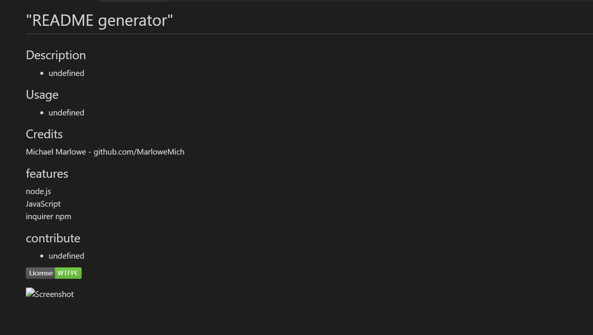

# "README generator"

  ## Description
  
  - "Provides an easy and fast way to generate a README.md for any project. This very readme was created using the application."
  
  ## Usage
  
  - "Simply run \"node index\" with the code saved somewhere on your local machine from the terminal. Answer the prompts and the information that you provide will be automatically placed in the appropriate places on the generated file. It is recommended to have the URL for a screenshot to be used handy as well as the github pages of all contributors to expedite the process."
  
  ## Credits
  Michael Marlowe - github.com/MarloweMich   

  ## Features

  node.js   inquirer npm   
  
  ## How to Contribute 
  
  - "Make a pull request to get involved"

  

  
  

  